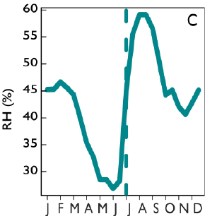
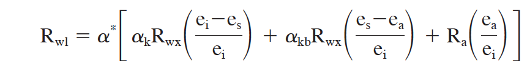

#####  Isotope Dendrochronology
#####  COURSE: DISC, LTRR, UNIVERSITY OF ARIZONA. INSTRUCTORS: P. SZEJNER & S. BELMECHERI


The following code and comments should further your experience of using a mechanistic model to understand the isotopic fractionation mechanisms underlying Oxygen isotope (d18O) in tree ring cellulose. This exercise will focus on the main determinants (variables and parameters) of cellulose d18O including: (1) source water isotope ratio, (2) leaf water isotopic enrichment, and (3) biochemical fractionation at the site of sucrose production and cellulose synthesis.

The exercise and the mechanistic model correspond to the process based model for the evaporative enrichment for d18O of open water surfaces developed by Craig and
Gordon (1965) [1]. The Craig–Gordon model was expanded to include leaf boundary layer considerations and diffusion through stomata, making it more appropriate for modeling leaf water [2].

[1] Craig H, Gordon L (1965) Deuterium and oxygen 18 variations in the ocean and the marine atmosphere. In: Tongiorgi E (ed) Stable Isotopes in Oceanographic Studies and Paleotemperatures. Consiglio Nazionale delle ricerche Laboratorio di Geologia Nucleare. Pisa, Spoleto, Italy, pp 9–130).

[2] Roden J, Lin G, Ehleringer JR (2000) A mechanistic model for interpretation of hydrogen and oxygen isotope ratios in tree-ring cellulose. Geochim Cosmochim Acta 64:21–35. https://doi.org/10.1016/S0016-7037(99)00195-7


The stable Oxygen isotope composition of cellulose (δ18Ocell) is determined by three factors/processes:  

1. The isotopic content of the source water.  
2. The leaf evaporative enrichment effect.   
3. The proportion of phloem sugars that exchange with source water during cellulose formation.   

The signal of these three processes is integrated into the cambium during xylogenesis. The goal of this exercise is to: (1) implement a mechanistic model to account for all these processes and their associated fractionations, (2) to use this mechanistic model to interpret variations of cellulose d18O. 

### Instructions :

You will simulate three different isotopic ratios in tree ring cellulose for different environmental conditions. These environmental condition reflect the growing season variability of relative humidity and precipitation experienced by trees growing in the US Southwest (See Figure 1). The growing season in this region is characterized by a bimodal distribution of precipitation (Winter-snowpack and Summer-Monsoon). The relative humidity varies from dry spring to humid summer. The two periods are separated by a hyper arid period with low precipitation and extremely low relative humidity. Accordingly, the variables in the model will vary as follows:  

* The relative humidity from 50% (spring) to 30% (pre-summer drought) to 60% (monsoon).  
* The mean air temperature will vary from 25, to 33, to 27 Celsius.  
* The source water will remain constant at -8 permill.     

At the end of the exercise, you will compare the simulated 18O cellulose for the 3 seasonal variations of RH and TAir emperature with measurements of cellulose d18O in tree rings from a site located in the US Southwest.



You will need to download the R project from https://github.com/paulszejner/DISCO-Notebook2.git and set your own working directory. Once you open the ```Notebook2.Rproj``` in R studio you can open the ```Notebook2.Rmd``` file to proceed with this exercise.

## PART 1: Source Water

The d18O of source water noted  as ```Source_18O``` is the isotopic ratio of the water transported through the xylem up to the leaves. This water is derived from direct precipitation and soil water taken up by the roots. This process does not alter the original d18O.
Thus, source water is the starting point of d18O that will be modified by the isotopic effects (fractionations) during all the steps leading to its fixation in tree ring cellulose. Having a robust estimation or measurement of source water d18O is therefore paramount.    

Here, the source water is set at a fixed value:
```{r}
Source_18O <- -8 # This is the isotopic value of the source water and  will remain constant at -8 permill during this  exercise
```
Then, it is converted to an isotopic ratio with regard to the standard VSMOW:  
```{r}
rsmow <- 0.0020052 # Oxygen Isotope ratio of the STANDARD	VSMOW
Rsource= rsmow*(1+Source_18O/1000) 
```


## PART 2: leaf water isotopic enrichment  

During plant transpiration, the heavier H218O evaporates and diffuses more slowly through the stomata than does H216O, leaving leaf water enriched in 18O. At steady state and considering the leaf as a single and isotopically well-mixed water pool, the leaf water isotopic enrichment can be estimated using the Craig-Gordon model as follows:



* R~wl~ is the isotope ratio of leaf water.
* R~wx~ is the isotope ratio of water in the xylem of tree rings (same as source water). 
* R~a~  is the isotope ratio of bulk air (Water vapor).
* $\alpha$* is the water liquid-vapor equilibrium isotope effect (dimensionless).
* $\alpha$~kb~ is the isotope effect for water associated with diffusion in
the boundary layer,
* e~a~ is the the vapor pressure in bulk air (kPa).
* e~i~ is the the vapor pressure in intercellular air space (Kpa).
* e~s~ is the the vapor pressure at the leaf surface.

### Climate Variables/Inputs

```{r}
# The three temperature and Relative humidity values need to be modified to reflect the seasonality described in the introduction (See Figure 1).

temperature <- c(40, 40, 40) # temperature here is in Celsius 
Relative_humidity <- c(100, 100, 100) # RH is in %
```

### Constants
These constants will be used to estimate/calculate the various model parameters, specifically
the water vapor mole fraction in the air and in the intercellular air spaces.  
```{r}
br <-1 # boundary layer conductance. (mol m-2 s-1), considered reasonable value between 0.02 to 3 in Roden paper boundary layer resistance.
ak <- 1.0285	#  Fractionation factor the liquid–vapor equilibrium fractionation factor and varies with temperature according to the equations of Majoube (1971).
akb <- 1.0189	#  Fractionation factor associated with diffusion in the boundary layer.
Stomatal_conductance <- 0.5 # stomatal conductance to water vapor.
# NOTE: stomatal conductance can be fixed or varies with respect to VPD.
press_bar <- 77 # barometric	pressure  (mmbar)  
```

### Model Parameters/Variables
#### Water Vapor (R~a~)

The  isotopic value of the water vapor is estimated based on source water d18O and leaf temperature, assuming equilibrium between atmospheric vapor and source water.  Water vapor can be estimates as follows:  

water_vapor = Source water + the equilibrium fractionation between liquid water and vapor.  

The equilibrium fractionation varies as a function of temperature.  

```{r}
# the temperature in the equation below refers to the leaf temperature in degrees Celsius and is converted to Kelvin (273.15)
water_vapor <-Source_18O +(-1*(1.137*(1000000/((temperature+273.15)^2))-0.4156*((1000/(temperature+273.15))-2.0667))) 
```

Then, it is converted to an isotopic ratio with regard to the standard VSMOW:  
```{r}
Ra= rsmow*(1+water_vapor/1000)
#note!  I need help on figuring out this! What is needed?
```

#### $\alpha$*
The equilibrium fractionation is temperature dependent (see Majoube, 1971, J. Chim. Phys. 58:1423-1436)  

```{r}
alpha_star =exp((1.137*1000/(273.15+temperature)^2)-(0.4156/(273.15+temperature))-0.0020667)
```

#### Water vapor mole fraction in the intercellular air spaces (e~i~)
Here we assume that the vapor is saturated inside the leaf. First, we estimate the vapor pressure e~i~ as follows:
```{r}
ei <- (101325*exp((((-0.1299*(1-(373.16/(273.15 + temperature)))-0.6445)*(1-(373.16/(273.15 + temperature)))-1.976)*(1-(373.16/(273.15 + temperature)))+13.3185)*(1-(373.16/(273.15 + temperature)))))/1000
```

Then  convert it to mole fraction as follows:
```{r}
wi=ei/press_bar
```

#### Water vapor mole fraction in the air (e~a~)
First, we estimate the vapor pressure e~a~ as follows:
```{r}
ea <- (Relative_humidity/100)*ei
```

Then convert it to mole fraction as follows:
```{r}
wa= ea/press_bar
```

#### Total Conductance (g)
The total conductance includes stomatal conductance to water vapor and boundary layer conductance:
``` {r}
g = 1/(1/Stomatal_conductance + 1/br) # or 1/(rs+rb)  in mol
```

#### Leaf transpiration (E)
Transpiration will depend on water vapor mole fraction in the air, in the leaf and on total conductance as follows:
``` {r}
E <- (wi-wa)*g #(mol m-2 s-1) # barbour 2004
```

#### Vapor pressure at leaf surface (e~s~)
First, we estimate the mole fraction of leaf surface water vapor w~s~ as a function of stomatal conductance, transpiration rate, and water vapor mole fraction in the intercellular air spaces:
``` {r}
ws <- ((Stomatal_conductance*wi)-E*(1-wi/2))/(Stomatal_conductance - E/2) # Roden (2000), Ball (1987).
```

Then convert it to vapor pressure as follows:
``` {r}
es <- ws*press_bar #(kPa) higher pressure  than the atmosphere
```

### Estimating Leaf water isotopic enrichment

Here is a recap of the estimated variables necessary to calculate leaf water following the equation provided above.

``` Rsource ``` isotope ratio of source water. 
```Ra``` isotope ratio of water vapor     
```ei``` Water vapor pressure inside the leaf    
```ea``` Water vapor pressure of the air  
```es``` Water vapor pressure at leaf surface  


The values can be rounded as follows:
``` {r}
round (Rsource, digits = 4)
round(Rwater_vapor, digits = 4)
round(esl, digits = 2)
round(ea, digits=2)
round(ei, digits=2)
```

The leaf water enrichment can be estimated as follows:
Remember to define the Xylem water (Rwx)
``` {r}
Rl <- alpha_star*(
    (ak*Rwx *((ei-es)/ei))+
    (akb*Rwx *((es-ea)/ei))+
    (Ra*(ea/ei))
  )
``` 

The leaf water enrichment is estimated in terms of isotopic ratio (R). It should be converted  to permill values as follows:

``` {r}
rsmow <- 0.0020052
leaf_water_18O <- ((Rl/rsmow)-1)*1000
round(leaf_water_18O, digits = 2)
```

Question 1: Compare the values of source water and leaf water d18O. How do they differ, what is the magnitude and the sign of the offset?
  
Question 2: Describe this offset in term of isotopic fractionation (enrichment).

NOTE: You can calculate isotope enrichment of bulk leaf water above source water
as an isotopic difference between leaf and source water (leaf_water_18O-Source_18O)

Question 3: Does the offset between source water and leaf water differ seasonally?

Question 4: Describe how variations in RH affect the leaf water isotopic ratio.


## PART 3: isotopic signal in the Cellulose  

The isotopic composition of cellulose is predicted as a function of:

* The isotope ratio of leaf water ```leaf_water_18O``` at the site of sucrose synthesis.

* A medium water (xylem water which is the same as source water).

* proportion (F_0) of carbohydrate d18O signal from leaf carbohydrate that exchanges with local water during formation of tree-ring or leaf cellulose (dimensionless).

* Biological fractionation factor ($\epsilon$~o~) for oxygen in going from sugars to cellulose (dimensionless). This corresponds to both the fractionation factors for autotrophic and heterotrophic fractionation of oxygen. because they are the same, there is no need to distinguish between the two ($\epsilon$~o~= 27‰).

```{r}
epsilon_o <-  27 

F_0 <- 0.42 # is the fraction of carbonyl oxygen atoms that exchange with non enriched water (source water). Typically, a value of 0.20–0.42 is used for 18O/16O (Cernusak, Farquhar, & Pate,2005; Helliker & Ehleringer, 2002; Roden & Ehleringer, 2000; Sternberg & Ellsworth, 2011), but these values are from greenhouse experiments and little is known about how Pex varies in situ seasonally or across spatial gradients.

cellulose_d18O= F_0*(Source_18O + epsilon_o) + (1 - F_0) * (leaf_water_18O+ epsilon_o) 
```
Question 5: Plot source, leaf and cellulose waters for the different seasonal variations.
            Describe the offsets in term of isotopic fractionation (enrichment).
 
Question 6: Does the offset between source/leaf water and tree ring cellulose differ                       seasonally?


Question 7: Describe how variations in RH affect the tree-ring cellulose isotopic ratio.

## PART 4: Model-Data comparison


your estimations for the predicted cellulose oxygen Isotopes are:
```{r}
predicted_18Oc <- round(cellulose_d18O, digits = 2)
```

These predicted cellulose_d18O values can be compared to measurements of cellulose 18O from tree rings of 5 Ponderosa pines growing in the Santa Catalina Mountains. The annual rings of these trees were analyzed at high intra-seasonal resolution and for the period of 1985-2014.

The annual ring was subdivided into two Earlywood parts (EW1 and EW2) and latewood (LW).
The average values were:

EW1 = 36 ± 1.3‰,
EW2 = 34.63 ± 1.3‰
LW =  33.81 ± 1.04‰.

The observed cellulose d18O can be defined as follows:
```{r}
observed_18Oc <- c(EW1,EW2,LW) 
```

Question 8: Compare observed and predicted cellulose d18O. 
You can use a boxplot to include both observed and predicted values.
Use a scatter plot of observed vs predicted cellulose d18O and include a 1:1 line to discuss model predictions (under or over prediction of cellulose d18O measurements).
Use linera regression statistics (r^2^) to discuss model performance.

Question 9: What model parameter or variable have the most influence on cellulose 18 prediction and its comparison to measurements (RH, source water,else?)


